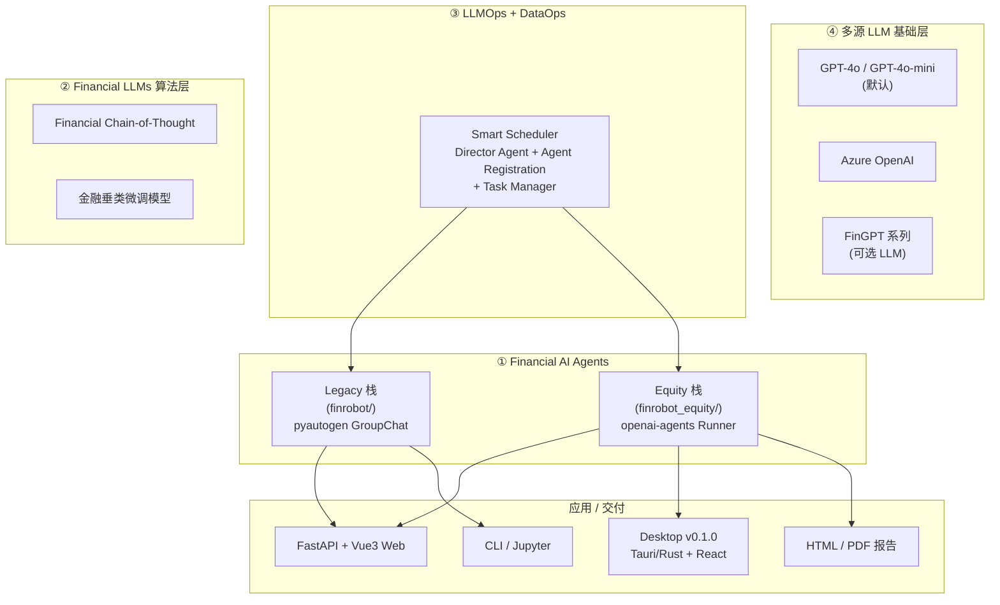

# FinRobot Deep Dive — 2026-09-10

> 参考项目: [AI4Finance-Foundation/FinRobot](https://github.com/AI4Finance-Foundation/FinRobot)
> 调研目的:为 TradingAgents Stage C「理财通用 Agent」设计提供对标启示
> 方法:浅克隆 + 只读,看 README、核心 Agent 入口、web 前端、数据源注册

## 项目概览

- **一句话定位**:面向金融分析师的多 Agent 投研自动化框架 + 配套桌面/ Web 投研工作站,核心理念是「deterministic 计算 + LLM 叙述」分离。
- **GitHub 仓库**:AI4Finance-Foundation/FinRobot(原名 FinGPT 团队)
- **License**:Apache-2.0(`LICENSE` / `NOTICE` 标明 © 2024-2026 AI4Finance Foundation)
- **最近 commit**:2026-09-07(README 更新,显示维护活跃)
- **产物形态**:**同一仓库里有三套并行产物**,需要区分:
  1. `finrobot/` — 老的 `pyautogen` 单/多 Agent 框架 + 自带工具集(开源原型)
  2. `finrobot_equity/` — 较新的 FastAPI Web 应用 + `openai-agents` 章节式 Agent + HTML/PDF 报告生成器
  3. `FinRobot Desktop v0.1.0` — 2026 年发布的 macOS Apple Silicon 原生桌面 App(Tauri/Rust + React),**核心代码不在本仓库**,README 用 release 链接分发
- **官方白皮书**:arXiv 2405.14767(Yang et al., 2024)

## 核心架构

仓库自描述是「四层 + 三模块」(Smart Scheduler 模型),但实际代码是双栈并存:



**模块职责**(以 `finrobot_equity/` 为主要参考栈):

| 模块 | 路径 | 职责 |
|------|------|------|
| 数据采集 | `finrobot/data_source/{finnhub,fmp,sec,yfinance,finnlp,reddit}_utils.py` | 行情 / 财报 / 公告 / 新闻 / Reddit 情绪 |
| 功能工具 | `finrobot/functional/{analyzer,charting,coding,quantitative,rag,ragquery,reportlab,text}.py` | 财务分析、画图、代码执行、回测、向量检索、PDF |
| Agent 注册中心 | `finrobot/agents/agent_library.py` | 用 dict 列表声明 Agent 名/profile/toolkits,运行时按名字查找 |
| 工作流引擎 | `finrobot/agents/workflow.py` | `SingleAssistant` / `SingleAssistantRAG` / `MultiAssistant` / `MultiAssistantWithLeader` 四种编排 |
| Web 入口 | `finrobot_equity/web_app/main.py` | FastAPI app + Jinja 模板 + 任务轮询 API |
| 章节 Agent | `finrobot_equity/core/src/modules/equity_agents/` | 8 个独立 Agent(tagline / investment / valuation / risks / competitor / news / overview / major_takeaways)|
| 报告编排 | `finrobot_equity/core/src/modules/equity_agents/agent_manager.py` | `EquityResearchAgentManager` 统一调度所有章节 Agent |

## Agent 设计

**两个并行的 Agent 体系**,需要分别看:

### A. Legacy 栈(`finrobot/agents/`)— pyautogen 风格

- **8 个预制 Agent**(见 `finrobot/agents/agent_library.py`):
  - `Software_Developer` / `Data_Analyst` / `Programmer` / `Accountant` / `Statistician` / `IT_Specialist` / `Artificial_Intelligence_Engineer` / `Financial_Analyst` / `Market_Analyst` / `Expert_Investor`
  - 通用角色型 profile(只有 `Market_Analyst` 和 `Expert_Investor` 绑定了具体工具集)
- **3 种编排模式**(`finrobot/agents/workflow.py`):
  1. `SingleAssistant` — 单 Agent + UserProxy,适合写代码
  2. `SingleAssistantRAG` — 加 `RetrieveUserProxyAgent`,文档检索
  3. `SingleAssistantShadow` — 配一个 Shadow Agent 静默校验
  4. `MultiAssistant` — `GroupChat` + 自定义 speaker selection func
  5. `MultiAssistantWithLeader` — Leader 下指令,各 Agent 嵌套对话(基于 `[AgentName]` 触发)
- **关键代码片段**(`finrobot/agents/prompts.py`):
  ```python
  leader_system_message = """
      You are the leader of the following group members: {group_desc}
      - End your response with an order to one of your team members to progress the project.
      - Orders should be follow the format: "[<name of staff>] <order>".
      - Make only one order at a time.
      Reply "TERMINATE" in the end when everything is done.
  """
  ```
- **协作模式**:**sequential / leader-driven / group-chat**,没有 debate;没有 streaming。

### B. Equity 栈(`finrobot_equity/core/src/modules/equity_agents/`)— openai-agents 风格

- **8 个章节 Agent**,**system prompt 主题**:
  | Agent | 主题 | 段落用途 |
  |-------|------|---------|
  | `tagline_agent` | 资深 equity analyst,3 句 executive tagline | 报告封面标题 |
  | `company_overview_agent` | 基础研究分析师(5 年 corporate strategy 经验) | 公司概览 |
  | `investment_overview_agent` | 投资观点 | 投资展望 |
  | `valuation_overview_agent` | 估值分析 | 估值章节 |
  | `risks_agent` | 战略风险分析师(对抗式思维) | 风险因素 |
  | `competitor_analysis_agent` | 竞品分析 | 竞品对比 |
  | `major_takeaways_agent` | 主要要点 | 摘要列表 |
  | `news_summary_agent` | 财经新闻分析师 | 新闻摘要 |
- **Prompt 范式**:统一 `[ROLE]` / `[INPUT DATA]` / `[ANALYSIS TASKS]` / `[OUTPUT REQUIREMENTS]` 四段式,强制结构化。
- **协作模式**:**sequential orchestration by `EquityResearchAgentManager`**,不是 multi-agent 对话,而是「一个 Manager 串行调用 8 个独立 Agent → 把结果组装成报告」。这跟 README 鼓吹的「9-agent 流水线」叙事略有出入——Equity 栈的「multi-agent」更接近「multi-prompt」,真正的多 Agent 对话只在 legacy 栈里。
- **8 个 Agent 共用一个数据准备器**(`_prepare_financial_data_prompt`),DataFrame → markdown → 塞进 prompt。
- **Pydantic 输出类型**(强 schema),例:`RisksResponse(BaseModel): risk_analysis: str`。

> **README 里说 9 个 Agent + 3 个 debate Agent**(`Bull/Bear/Judge`)是 Desktop v0.1.0 的描述,**未在 git 仓库核心代码里出现**,是闭源/独立发布。

## 工具系统

**注册机制**(`finrobot/toolkits.py`):

```python
def register_toolkits(config, caller, executor):
    for tool in config:
        if isinstance(tool, type):
            register_tookits_from_cls(caller, executor, tool)  # 类反射出全部 public 方法
        tool_dict = {"function": tool} if callable(tool) else tool
        register_function(
            stringify_output(tool_function),  # DataFrame → str
            caller=caller, executor=executor,
            name=..., description=...,
        )
```

**两种注册粒度**:
- 函数级:`toolkits=[FinnHubUtils.get_company_profile, ...]`
- 类级:`register_tookits_from_cls(cls)` 自动注册该类所有 public 方法

**典型工具数量**(按主题分组):

| 类别 | 工具来源 | 数量 | 路径 |
|------|---------|------|------|
| 公司画像 | FinnHub `get_company_profile` 等 | ~4 | `data_source/finnhub_utils.py` |
| 行情 | `YFinanceUtils.get_stock_data` 等 | ~6 | `data_source/yfinance_utils.py` |
| 财报 | `FMPUtils.get_financial_metrics` 等 | ~8 | `data_source/fmp_utils.py` |
| SEC 公告 | `SECUtils.get_10k_section` 等 | ~3 | `data_source/sec_utils.py` |
| 新闻 | FinnHub / FinNLP / Reddit | 6 | `data_source/{finnhub,finnlp,reddit}_utils.py` |
| 财务分析 | `ReportAnalysisUtils.analyze_income_stmt` 等 | ~8 | `functional/analyzer.py` |
| 画图 | `ReportChartUtils` / `MplFinanceUtils` | ~10 | `functional/charting.py` |
| 代码执行 | `CodingUtils.{list_dir,see_file,modify_code,create_file_with_code}` | 4 | `functional/coding.py` |
| PDF | `ReportLabUtils.build_annual_report` | ~5 | `functional/reportlab.py` |
| 量化 | `BackTraderUtils` + `DeployedCapitalAnalyzer` | ~6 | `functional/quantitative.py` |

**隔离机制**:
- 通过 `caller`/`executor` 两个 `ConversableAgent` 配对注册,实现「助理提出工具调用 → UserProxy 执行并回填」
- `stringify_output` 装饰器把 `DataFrame` 强制转字符串喂回 LLM(避免结构化数据丢失)
- `is_termination_msg=lambda x: x["content"].endswith("TERMINATE")` — 通过关键字终止会话

**RAG**:封装在 `SingleAssistantRAG` 里,底层用 `autogen.agentchat.contrib.retrieve_user_proxy_agent`(`finrobot/functional/rag.py`),文档检索 + 重建 prompt,默认用 sentence-transformers embedding。

## 数据流

**典型流程**(以「生成一份 NVDA 报告」为例):

```
User 在 Web 输入 ticker
    ↓
POST /api/run  → FastAPI 创建 task_id,挂后台任务
    ↓
execute_analysis_pipeline (background_tasks)
    ├─ Step1: generate_financial_analysis.py
    │   ├─ FMP API 拉财务数据(收入/资产负债/现金流)
    │   ├─ 算 3 年预测 + DCF + peer EV/EBITDA
    │   └─ 落盘 output/{TICKER}/analysis/*.csv
    ├─ Step2: create_equity_report.py
    │   ├─ EquityResearchAgentManager 串行调 8 个章节 Agent
    │   ├─ 每个 Agent 拿同一份财务数据 prompt → LLM
    │   └─ 拼成 HTML / PDF
    └─ Step3: generate_pdf_report.py (可选)
    ↓
GET /api/status/{task_id}  轮询(每 1 秒一次)拿阶段
    ↓
GET /api/logs/{task_id}  把日志以文件形式下载
```

**RAG / 缓存 / 记忆**:
- **RAG**:有(`SingleAssistantRAG` + `functional/rag.py` + `ragquery.py` 用 ChromaDB),但只用在 legacy 栈,Equity 栈没用 RAG
- **缓存**:`autogen.cache.Cache.disk()`(`workflow.py`),按 session 把 LLM 调用结果序列化到磁盘,适合回放调试
- **记忆**:**无跨 session 长期记忆**。Web 应用只持久化:`User` / `Session` / `ReportRequest` / `RequestLog`(`finrobot_equity/web_app/database/models.py`),**没有 conversation history 表**——agent 是「一次性研究任务」,不是「持续对话伙伴」

## LLM 配置

- **默认模型**:
  - Legacy 栈:`gpt-4-0125-preview`(`agent_builder_demo.py` 硬编码)
  - Equity 栈:`gpt-4o-mini`(`text_generator_agents.py:104`),可被环境变量 `OPENAI_MODEL_NAME` 覆盖
- **Provider**:OpenAI / Azure OpenAI(`OAI_CONFIG_LIST` 支持多个 config entry),不支持 Anthropic / 国产模型开箱即用
- **切换方式**:`llm_config` dict 透传到 `autogen` / `openai-agents`,支持 `base_url` 自定义(`text_generator_agents.py:127` 支持 SiliconFlow proxy),即可以接兼容 OpenAI 协议的中转服务
- **路由/调优**:`Smart Scheduler` 是 README 里描述的「Director Agent + Task Manager」,**实际代码里没有这个模块**,只是 marketing 图

## UI 设计

**Web 应用**(`finrobot_equity/web_app/main.py` + `templates/index.html`):

- **后端**:FastAPI + SQLAlchemy(SQLite 默认,生产可换 PostgreSQL via `pg8000`),Jinja2 模板
- **前端**:**Vue 3 (CDN 引入,无构建) + Tailwind (CDN) + 原生 HTML**,**不是** React/SPA
- **形态**:左侧 `aside w-96` 侧栏(填 ticker → company name → ready),主区是「报告输出 + 任务历史 + 日志」,**没有 chat 面板**,**没有 drawer 抽屉**
- **实时性**:**用 `setInterval(pollTasks, 1000)` 轮询 `/api/status/{task_id}`**,**没有 SSE / WebSocket / EventSource**——长任务(典型 5-15 分钟)用户体验差
- **鉴权**:GitHub OAuth + 本地 email/password(bcrypt 哈希)+ Session cookie;有 `/admin_routes` 管理面板
- **持久化**:SQLite 记录 user / session / report_request / request_log;任务日志额外落盘到 `logs/task_{id}.log`(JSON 可读)
- **Desktop v0.1.0**:README 描述基于 **PydanticAI + FastAPI + React/Tauri** 的 macOS 原生 app,**核心代码不在此 repo**;所谓「9 个 agent 流水线」主要在 Desktop 端实现

**对比我们 TradingAgents 的预期**:FinRobot 没有「常驻 chat / 抽屉式对话」形态——它走的是「表单 + 进度条 + 报告下载」的 SaaS 工具型 UX,**不是「对话式伙伴」UX**。

## 跟我们项目的对标启示

| 维度 | FinRobot | 我们 Stage C(目标) | 启示 |
|------|---------|---------------------|------|
| UX 形态 | 表单 + 长任务 + 报告下载 | 常驻 drawer 对话 + SSE 流 | **不照搬**,走对话路线 |
| Agent 数 | 8-9 个章节 Agent(sequential) | LangGraph `create_react_agent`(单入口) | 借鉴「每章节一个强 schema Agent」的拆分思路,但用 ReAct 而不是串行 |
| Prompt 范式 | `[ROLE]/[INPUT]/[TASKS]/[OUTPUT]` 四段式 | 未定 | **值得抄**,prompt 模板化、force structure output |
| 数据缓存 | `autogen.cache.Cache.disk()` | 无 | 借鉴 session 级 LLM 调用持久化(回放调试 + 单元测试) |
| 任务编排 | 后台 `BackgroundTasks` + UUID task_id | 倾向 in-process | 借鉴 UUID task_id + 落盘日志模式,前端可断网重连 |
| LLM 配置 | OpenAI 全家桶,`OPENAI_MODEL_NAME` env 覆盖 | 应支持多 provider | 借鉴 env 切换,但要补齐国产模型 |
| 长期记忆 | **无 conversation history** | MemorySaver + SQLite 三层 | 我们反而要**避免这个坑**,FinRobot 没做对话记忆,我们 Stage C 必须做 |
| 数据源 | FinnHub + FMP + yfinance + SEC + Reddit + Adanos | 自有 dataflows | 借鉴「多 provider + failover」架构思路 |
| 鉴权 | GitHub OAuth + bcrypt session | 单用户假设(暂) | 暂不需要,但架构上要可插拔 |

**关键差异**:FinRobot 把 Agent 当「一次性研究流水线工人」,我们把 Agent 当「持续对话伙伴」——这决定了很多设计不同(记忆、流式 UX、路由分发)。

## 借鉴清单

可复用的具体设计点(按优先级):

1. **Agent 注册表(dict-based Agent Library)** — `finrobot/agents/agent_library.py` 用一个 Python dict 列表把 Agent 的 `name / profile / toolkits` 集中声明。我们 Stage C 可以做一个 `agent_registry.py`,把 alpha158 tools / fundamentals analyst / market analyst 都按这个格式注册,便于 UI 展示和动态启用。
2. **强 schema 输出(Pydantic BaseModel)** — 每个章节 Agent 用 `output_type=XxxResponse(BaseModel)` 强制结构化输出(`risks_agent.py:73`),比 free-form text 可靠 100 倍。我们每个 tool 的返回应该强制走 Pydantic schema。
3. **`[ROLE]/[INPUT]/[TASKS]/[OUTPUT]` 四段式 Prompt 模板** — 见 `risks_agent.py:30-69`。可直接用作我们 Stage C 的 system prompt 模板基础。
4. **`stringify_output` 装饰器 + 工具函数签名 + Annotated 注解** — `toolkits.py:6-16` + `data_source/finnhub_utils.py:34`(`def get_company_profile(symbol: Annotated[str, "ticker symbol"])`)三件套。我们应该统一所有 tool 用 `Annotated[type, "description"]` 写签名,LLM 看 docstring 选工具时会更准。
5. **类级自动注册工具**(`register_tookits_from_cls`) — `toolkits.py:80-106`,把类所有 public 方法一次性注册。我们可以给 `dataflows/` 里每个数据接入写一个类,新加 provider 零配置。
6. **持久化日志 + UUID task_id + 落盘文件** — `finrobot_equity/web_app/main.py:69-95` 把每条 log 同时写内存 + 文件,即使后端重启也能从文件恢复。**值得抄**,我们 Stage C 的 agent 长任务也要这样做。
7. **Session 级 LLM 调用磁盘缓存** — `workflow.py:130-135` 用 `with Cache.disk() as cache:` 包裹对话。便于离线回放和单元测试 fixture。
8. **`OPENAI_MODEL_NAME` env + `base_url` 覆盖** — `text_generator_agents.py:104` + `:127`,无需改代码即可切模型/代理。我们 Stage C 必须支持国产模型。
9. **Sequential 章节 Agent 串行编排** — `agent_manager.py:generate_text_section` 按 `text_type` 字典查 Agent。**思路可用但不要照搬**:我们是 ReAct,不是串行,但「按意图挑 Agent」这个抽象值得保留(对应我们 spec 里的 routing logic)。
10. **SQLAlchemy + bcrypt + GitHub OAuth 三件套** — `web_app/auth.py` + `database/models.py` 单文件搞定鉴权。我们 Stage C 暂不需要,但等做多用户时可直接借鉴。

## 风险 / 坑

1. **双栈分裂,文档/代码不一致** — README 鼓吹的「9-Agent + Bull/Bear/Judge + Smart Scheduler + Desktop」在 git 仓库里**几乎都看不到**,核心代码是 `finrobot/`(autogen 老栈)+ `finrobot_equity/`(openai-agents 新栈)+ Desktop 是独立发布。**警示**:不要看 README 决定架构,要看代码。
2. **没有跨会话对话记忆** — `database/models.py` 只有 user/session/report_request,无 conversation 表。如果你想像 FinRobot 那样「一个任务跑完结束」可以接受,但我们要做 Stage C 持续对话伙伴,**这块必须自建**(MemorySaver + SQLite)。
3. **轮询 1 秒 / 次,无 SSE** — `templates/index.html:520` `setInterval(pollTasks, 1000)`。长任务(5-15 分钟)前端体验差,而且浪费带宽。我们 Stage C 必须上 **SSE 流**(spec 里已经写了)。
4. **重 OpenAI/重英文** — `text_generator_agents.py` 默认 `gpt-4o-mini`,所有 prompt 是英文,所有 prompt 模板里要求「plain text no markdown」。我们中文用户,**prompt 必须本地化 + 允许 markdown**。
5. **数据源依赖第三方付费 API** — FinnHub / FMP / Adanos 都是付费 SaaS,有 rate limit。我们自有 dataflows 是优势,但要警惕「过度依赖单一数据源」的诱惑(FinRobot 的 `market_data_api.py` 就有 `fetch_fmp_*` / `fetch_yfinance_*` 大量重复).
6. **LLM 计算财务数字的风险** — README 强调「Numbers are code-calculated. Narratives are LLM-assisted.」,但实际 `analyzer.py:analyze_income_stmt` 把财报 + SEC section 文本直接塞 LLM 让它「总结 4-5 个 key points」,**LLM 可能在数字上 hallucinate**(prompt 长度 130 字,信息密度高但无 ground truth)。我们 Stage C 做数值相关 tool 时必须**有显式的 ground truth 引用 + 数字溯源**。
7. **代码执行风险** — `SingleAssistant.code_execution_config = {"work_dir": "coding", "use_docker": False}` 默认**不开 Docker 沙箱**,LLM 写的 Python 直接 host 执行(`agent_builder_demo.py` 同)。我们 Stage C 必须开 docker 沙箱或 subprocess 隔离。
8. **`stringify_output` 丢掉结构** — `toolkits.py:6-16` 把 DataFrame 强制转 str,Lost information。我们 tool 返回如果给前端用,要么返回结构化 JSON,**不要**全 stringify。
9. **硬编码 fallback 文案** — `text_generator_agents.py:20-29` 当 API key 缺失时,塞假话给用户。这是**反模式**,我们必须 fail loud。

