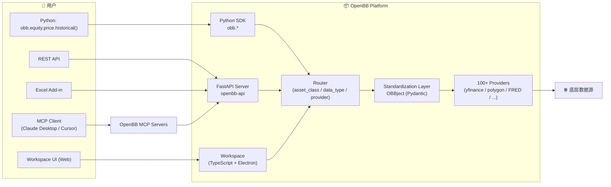

# OpenBB Deep Dive — Open Data Platform for Finance

> 研究日期:2026-09-10  
> 调研者:Hypatia / 主线程整理  
> 研究目的:为 TradingAgents "理财通用 Agent" (Stage C) 提供**统一数据层**对标

---

## 1. 项目概览

| 项目 | OpenBB-finance/OpenBB |
|------|------|
| **定位** | **Open Data Platform (ODP) for Finance** — "connect once, consume everywhere",把分散的金融数据源/工具/SaaS 统一到一个开放平台 |
| **核心资产** | OpenBB Platform (Python SDK + REST + Workspace UI + Excel Add-in + MCP servers) |
| **License** | **AGPL-3.0**(强 copyleft,商用要谨慎;跟我们的 MIT 不一样) |
| **规模** | 主仓 34M+ (含 submodules) |
| **技术栈** | Python (核心) + TypeScript (Workspace UI) + Electron (桌面) |
| **商业模式** | 有 OpenBB Pro / Cloud (付费),主仓开源 |
| **数据源覆盖** | 100+ providers: yfinance / Polygon / FRED / SEC / Bloomberg / ... |

**核心心智**:**"数据中介层 (data intermediary layer)"** — 把"碎片化的金融数据 API"封装成统一接口,用户调用 `obb.equity.price.historical("AAPL")` 就能拿到数据,不用关心底层是 yfinance 还是 Polygon。

---

## 2. 核心架构



**架构特点**:
- **4 个 surface 共享一套底层**:Python SDK / REST API / Workspace UI / Excel Add-in 全部走同一套 router
- **Provider 抽象**:加新数据源只需写一个 provider adapter,自动被所有 surface 看到
- **OBBject (Pydantic-based)**:所有响应统一为 OBBject,带 results / provider / warnings / chart 字段
- **MCP 是 first-class** — 直接暴露 MCP servers 给 AI agent 用(Stage C 范式!)

---

## 3. 数据抽象层(关键)

```python
# OpenBB Platform 链式 API 设计
from openbb import obb

# 同样的调用,底层可以切换 provider
data = obb.equity.price.historical("AAPL", provider="yfinance")
data = obb.equity.price.historical("AAPL", provider="polygon")  # 同样的结果

# 多个 asset_class
obb.equity.price.historical(...)    # 股票
obb.derivative.options.chains(...)  # 期权
obb.forex.currencies(...)           # 外汇
obb.crypto.price.historical(...)    # 加密货币
obb.economy.gdp(...)                # 宏观

# 输出统一是 OBBject
print(data.results)     # pandas DataFrame
print(data.provider)    # "yfinance"
print(data.warnings)    # []
print(data.chart)       # chart 配置
```

**关键设计**:
- **路由命名空间**:`{asset_class}.{data_type}.{action}` 三段式
- **Provider 参数**:调用时动态选,不绑死
- **OBBject 统一包装**:结果 + 元数据(provider / warnings / chart)

---

## 4. Provider 机制(我们重点参考)

```python
# 一个 provider 注册示例(简化版)
from openbb_core.provider.abstract.fetcher import Fetcher

class YFinanceEquityHistoricalFetcher(Fetcher):
    """Yahoo Finance 历史行情 fetcher."""

    @staticmethod
    def transform_query(params: dict):
        return YFinanceEquityHistoricalQueryParams(**params)

    @staticmethod
    def extract_data(query, credentials, **kwargs):
        symbol = query.symbol
        df = yf.download(symbol, ...)
        return [YFinanceEquityHistoricalData(**row) for row in df.to_dict("records")]

    @staticmethod
    def transform_data(data, query, **kwargs):
        return [YFinanceEquityHistoricalData(**d) for d in data]
```

**Provider 注册流程**:
1. 定义 `QueryParams`(输入 Pydantic model)
2. 定义 `Data`(输出 Pydantic model,字段标准化)
3. 实现 `Fetcher.transform_query / extract_data / transform_data`
4. 在 `__init__.py` 注册到 `PROVIDERS` dict
5. Router 自动发现,`obb.equity.price.historical(provider="yfinance")` 即可用

**对我们 TradingAgents 的启示**:
- 我们当前有 `yfinance / EastMoney / AKShare` 3 个 provider,各自有不同的调用方式
- 应该统一一个 `Provider` 抽象,接口对齐(`get_quote / get_history / get_fundamentals`)
- 内部用 `dict` 注册: `{provider_name: ProviderInstance()}`

---

## 5. 5 个 Surface 共享底层

| Surface | 入口 | 用户 |
|------|------|------|
| **Python SDK** | `obb.equity.price.historical(...)` | 程序员/数据科学家 |
| **REST API** | `openbb-api`(FastAPI 6900) | Web / 移动端 |
| **Workspace UI** | TypeScript + Electron | 普通用户 |
| **Excel Add-in** | OpenBB in Excel | 金融分析师 |
| **MCP Servers** | `openbb-mcp`(暴露给 Claude/Cursor) | AI agent ⭐ |

**关键启示**:Stage C 的 agent 应该把我们的核心 tools(quote / history / fundamentals / alpha158 / ...)通过 **MCP server** 暴露,这样外部 agent(Claude Desktop / Cursor / 用户自己的 LangGraph)都能直接调用,不必启动我们的 Web。

---

## 6. Extension / Plugin 机制

```python
# 第三方扩展示例
from openbb import obb

@obb.provider
def my_custom_provider():
    """注册一个自定义 provider."""
    return MyProvider()

# 之后 obb.equity.price.historical(provider="my_custom_provider") 就能用
```

**机制**:
- **OBBject decorator** + **entry_points** 机制
- 第三方包用 `pyproject.toml` 的 `entry_points` 注册到 OpenBB
- OpenBB 启动时扫描所有 entry_points,加载 provider / router / extension

---

## 7. 缓存层

```python
# OpenBB 内置缓存(默认 ~/.openbb_platform/cache/)
obb.cache.clear()         # 手动清缓存
obb.cache.enabled = True  # 默认启用
```

- **基于磁盘缓存**(SQLite / Parquet 二选一)
- **按 (provider, endpoint, params) 缓存**
- **TTL 可配**

**跟我们类似**:我们 v0.5.0 已经有 `~/.tradingagents/data_cache/`,用 SQLite + TTL。

---

## 8. 跟我们项目的对标启示

| OpenBB 设计 | 我们现状 | 启示 |
|------|------|------|
| **链式 API** `obb.equity.price.historical()` | 我们是 `web_quotes_api(symbols=...)` | 可以引入轻量 SDK 层(给外部 agent / 用户脚本用) |
| **Provider 抽象** | yfinance / EastMoney / AKShare 各写各的 | **可建 `data/providers/base.py`**:`Provider` ABC + 注册表 |
| **OBBject 统一包装** | 我们 dict + Pydantic 混用 | 统一为 `DataResponse(results, provider, warnings, fetched_at)` |
| **5 个 surface 共享底层** | 只有 Web UI + REST | **可加 MCP server**(Stage C 重点!) |
| **AGPL-3 license** | MIT | 商用要注意(AGPL 强制衍生作品开源) |
| **Workspace UI** | 我们的 web/ | Workspace 设计值得借鉴(Widget 化 + 自定义 dashboard) |
| **Provider 100+** | 3 个 | 短期内不追广度,先把 3 个做深 |

---

## 9. 借鉴清单(直接落地)

1. **Stage C 必做 MCP server** — 暴露 8-12 个 tool 给 Claude Desktop,直接参考 OpenBB MCP server 实现
2. **轻量 Python SDK** — `from tradingagents import ta; ta.quote.get("600036.SS")` 这种链式 API
3. **统一 Provider 抽象** — `data/providers/base.py` 定义 ABC,3 个 provider 各自实现
4. **统一 DataResponse** — `results, provider, fetched_at, warnings, chart`,跟 OBBject 对齐
5. **Provider 注册表** — `PROVIDERS = {"yfinance": YFinanceProvider(), "eastmoney": EastMoneyProvider(), "akshare": AKShareProvider()}`
6. **Symbol 标准化** — 内部统一 `symbol` 表示(`600036.SS` / `AAPL` / `BTC-USD`),provider 内部转
7. **`fetched_at` 时间戳** — 所有数据响应都带,Stage C agent 用来判断 stale
8. **缓存按 (provider, endpoint, params) key** — 我们已经有 SQLite,可扩展
9. **warning 字段** — provider 失败 / 数据缺失时返回 warning,而不是抛错(API 更友好)
10. **REST API 自动从 Pydantic 生成 schema** — `obb.equity.price.historical` 的参数/返回值都是 Pydantic,FastAPI 自动 OpenAPI doc

---

## 10. 风险 / 坑

1. **AGPL-3.0 license** — 不能直接 fork / 修改 OpenBB 代码商用,只能参考设计。**绝对不要直接用 OpenBB 的 binary**(AGPL 污染)
2. **复杂度高** — ODP 覆盖 100+ provider,我们的需求(3-5 个 provider)用不到那种规模,**过度抽象反而拖慢开发**
3. **Provider 100+ 维护成本** — OpenBB 有专门团队维护,我们资源有限,**重点做 EastMoney + AKShare 即可**
4. **OBBject 的 Pydantic 模型深度嵌套** — 直接参考有学习成本,我们用简化版 `DataResponse` 即可
5. **Workspace UI 重** — OpenBB Workspace 是 TypeScript + Electron,我们做 Web 端轻量即可
6. **多 provider 数据一致性** — 同一个 symbol 在 yfinance / EastMoney 可能有细微差异,需要在 OBBject 里标识 source
7. **浅克隆受限** — OpenBB 仓库含 submodules,浅克隆会失败,本地完整 clone 占用大(>1GB)

---

## 11. 关键文件路径(基于公开仓库结构)

```
# 公开仓库结构(基于 README + docs.openbb.co):
├── openbb_platform/                  # Python SDK + Provider 框架
│   ├── openbb/                       # 入口包
│   │   ├── core/                     # 核心 (router / provider 抽象)
│   │   ├── providers/                # 100+ provider 适配
│   │   │   ├── yfinance/
│   │   │   ├── polygon/
│   │   │   └── ...
│   │   └── extension/                # 第三方扩展
│   └── pyproject.toml
├── openbb_platform/                  # Workspace UI (TypeScript + Electron)
│   └── packages/
│       ├── openbb-widget/
│       └── ...
└── build/                            # 编译产物
```

⚠️ 注:浅克隆失败(`/tmp/openbb-research/` 只有 `.git`),调研基于 README + docs.openbb.co + 公开 GitHub API。

---

**TL;DR**:OpenBB 给我们最重要的启示是**"统一 Provider 抽象 + 链式 API + MCP server first-class"**。我们 Stage C 要做的 MCP server 和统一数据层,可以直接参考 OpenBB 的设计模式。但**不要直接用 OpenBB 代码**(AGPL 污染),只学其架构。
