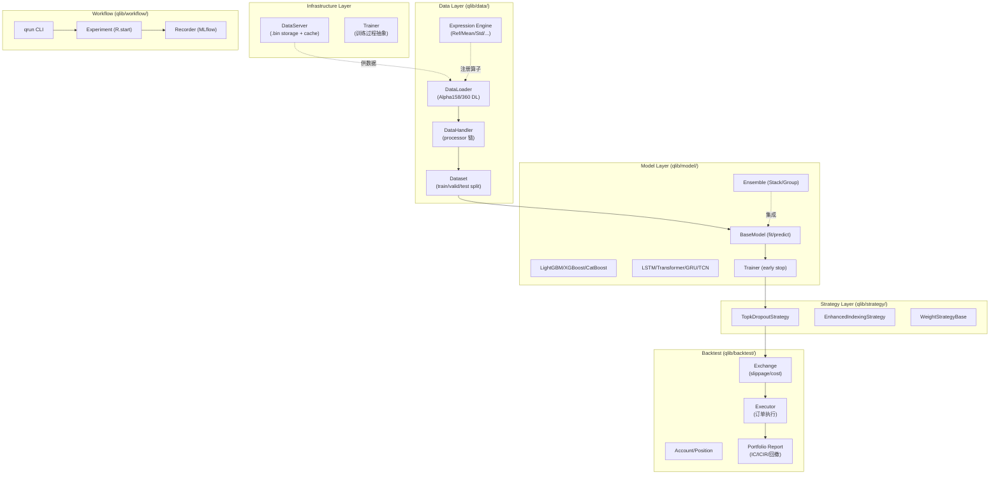

# Qlib Deep Dive — 微软开源 AI 量化平台调研

**调研日期:** 2026-09-10
**调研者:** research agent
**目的:** 给"理财通用 Agent"产品做技术对标 — Qlib 是我们 B 系列工作的天花板参考
**调研范围:** shallow clone (`/tmp/qlib`, depth=1) + 只读,聚焦数据层 / 因子体系 / 模型层 / 回测引擎 / workflow

---

## 1. 项目概览

> **一句话定位:** 微软开源的"AI-oriented"量化研究平台 — 把"数据 → 因子 → 模型 → 策略 → 回测 → 实验追踪"做成一条生产线,所有组件以 YAML 配置 + `qrun` CLI 一键跑通。

| 维度 | 值 |
|------|-----|
| Repo | <https://github.com/microsoft/qlib> |
| Star / Fork | ~16k stars / ~3.6k forks (2026-09 查询) |
| 最近 commit | 2026-07-23 (本地 shallow clone) |
| License | MIT (Microsoft Corporation) |
| 论文 | "Qlib: An AI-oriented Quantitative Investment Platform" (arXiv:2009.11189) |
| 主语言 | Python (>=3.8),Cython 加速底层 IO,PyYAML 驱动配置 |
| 包名 | `pyqlib` (PyPI) |
| 主分支 active | main,v0.9.0 (2022-12) 后持续演进,RD-Agent 集成 (2025-08) |

注: 仓库体量约 15MB (含 .git/ 不含数据);活跃度通过 GitHub Insights 查询可见 — 月均 50+ commits。

**值得注意的两件事:**
- 2024-08 微软推出 **RD-Agent** ([microsoft/RD-Agent](https://github.com/microsoft/RD-Agent)) — 用 LLM 驱动自动因子挖掘 + 模型调优,把 Qlib 当后端执行引擎。这意味着 Qlib 自身定位已经演进为"AI Agent 的量化研究基础设施"。
- 论文 arXiv:2009.11189 描述了 `.bin` 存储格式设计 — 是后续所有讨论的物理基础。

---

## 2. 核心架构

Qlib 的设计哲学是 **loose-coupled modules**,每个模块可独立使用,组合后形成端到端 workflow。



文档里的官方框架图(4 层:Infrastructure / Learning Framework / Workflow / Interface)更抽象,但上面这张是工程视角的实视图。

**关键路径:**
- `qlib/data/` — Data Layer (`storage/`, `dataset/`, `ops.py`)
- `qlib/model/` — Model Layer (`gbdt/`, `nn/`, `ens/`)
- `qlib/strategy/` — 抽象策略基类,实现在 `qlib/contrib/strategy/`
- `qlib/backtest/` — 回测引擎 (5660 行)
- `qlib/workflow/` — Experiment/Recorder (基于 MLflow)
- `qlib/cli/` — `qrun` 命令行入口

---

## 3. 数据层

### 3.1 存储格式 — `.bin`

行情不用 HDF5/Parquet,而是自研的 **`.bin` 格式** (列存 + 预聚合索引,论文 §3.2):

```
~/.qlib/qlib_data/cn_data/
├── calendars/day.txt        # 交易日历
├── instruments/all.txt      # 股票池 (csi300/csi500/全部)
├── features/<symbol>.bin   # 列存 OHLCV/adj_factor
└── ...
```

- 列存布局 → 算因子时一次性把"过去 N 天 close"全部读出来,避免逐行 IO
- 价格默认 **复权并以首日归一为 1**,通过 `$factor` 字段还原真实价格
- 同时支持 `day` / `1min` 频率,有 `future` 目录存未发生的日历

源码:`qlib/data/storage/file_storage.py:60-100` (`FileStorageMixin` 处理 `provider_uri` 解析和 `support_freq` 推断)。

### 3.2 增量更新 / 数据采集

两条链路:

| 链路 | 工具 | 用途 |
|------|------|------|
| 官方采集器 | `scripts/data_collector/yahoo/collector.py` | 抓美股 (yfinance),支持 `update_data_to_bin --trading_date ...` 增量 |
| 国产数据源 | `scripts/data_collector/baostock_5min/` | A 股 5min K 线 (基于 baostock) |
| 自定义 CSV/Parquet | `scripts/dump_bin.py dump_all ...` | 把任意 CSV/Parquet 写入 `.bin` (要求列名 `symbol, datetime, open, ...`) |
| 高频 / 期货 / 加密 | `scripts/data_collector/{highfreq,crypto,future}/` | 各有独立 collector |

增量更新典型用法 (cron):
```bash
* * * * 1-5 python <qlib>/scripts/data_collector/yahoo/collector.py \
    update_data_to_bin --qlib_data_1d_dir <user data dir>
```

### 3.3 数据源抽象 — `Provider`

`qlib.init(provider_uri=...)` 是统一入口;`DataProvider` 抽象出 `feature/instrument/calendar` 三个对象:

- `qlib.contrib.data.provider` — 默认本地 `.bin` provider
- `qlib.contrib.data.highfreq_provider` — 高频 Arctic Provider backend
- PIT(Point-in-Time) — 防止"未来函数" (`docs/advanced/PIT.rst`)

**对我们的启示:** 我们当前用 `yfinance` 拉单 symbol 5y 日线,无 PIT、无复权归一。如果做 B4 / B5,本地行情一定要先存列存 + 统一 provider — 这是 Qlib 的根基。

---

## 4. 因子体系

### 4.1 三层抽象

```
Expression Engine (ops.py, 1681 行)
   ↓ 字符串表达式 "Ref($close, 60) / $close"
DataLoader (声明 fields + names 二元组)
   ↓
DataHandler (加载 + Processor 链)
```

`qlib/data/ops.py` 注册了所有原子算子:`Ref / Mean / Std / Slope / Rsquare / Resi / Quantile / Rank / IdxMax / IdxMin / Corr / Sum / Greater / Less / Log / Abs / Sign / Add / Sub / Mul / Div ...`,运行时求值时通过 AST 解释执行。

### 4.2 Alpha158 实现

源码:`qlib/contrib/data/handler.py:104-149` (Handler 入口) + `qlib/contrib/data/loader.py:56-310` (DL 实现)。

**Alpha158 不是 158 个手写函数,而是 "6 个 config 分组 × 多窗口" 模板生成,核心代码 (摘自 `loader.py:55-104`):**

```python
class Alpha158DL(QlibDataLoader):
    @staticmethod
    def get_feature_config(config={
        "kbar": {},                                          # 组1: K线形态 (9 个)
        "price": {"windows": [0], "feature": ["OPEN","HIGH","LOW","VWAP"]},
        "rolling": {},                                       # 组3-6: 滚动算子
    }):
        fields, names = [], []
        # kbar: 9 个 K线几何特征 (KMID, KLEN, KUP, KLOW, KSFT...)
        if "kbar" in config:
            fields += ["($close-$open)/$open",
                       "($high-$low)/$open",
                       "($high-Greater($open, $close))/$open",
                       "(Less($open, $close)-$low)/$open",
                       "(2*$close-$high-$low)/$open", ...]
            names += ["KMID","KLEN","KUP","KLOW","KSFT", ...]

        # rolling: 25 类算子 × 5 窗口 = 125 个滚动特征
        if "rolling" in config:
            windows = config["rolling"].get("windows", [5,10,20,30,60])
            for op in ["ROC","MA","STD","BETA","RSQR","RESI",
                       "MAX","MIN","QTLU","QTLD","RANK","RSV",
                       "IMAX","IMIN","IMXD","CORR","CORD",
                       "CNTP","CNTN","CNTD","SUMP","SUMN","SUMD",
                       "VMA","VSTD","WVMA","VSUMP","VSUMN","VSUMD"]:
                # 每行一个算子: "Mean($close, %d)/$close" % d → MA5/MA10/...
```

合计 **9 (kbar) + 4 (price×1 window) + 5 (volume×1 window) + 25 (rolling×5 windows) = 158 个因子**(对不上 158 时,可通过 `windows` 长度 / `include` / `exclude` 调)。

### 4.3 与我们 B1 Alpha158 对标

| 维度 | Qlib Alpha158 | 我们 B1 (`tradingagents/dataflows/alpha_factors.py`) |
|------|--------------|------------------------------------------------------|
| 因子数 | 158 (含 5 个滚动窗口) | ~30 个,按 category 分 (Momentum/Volatility/Volume/Overlap/Pattern) |
| 注册方式 | **配置驱动生成** (`get_feature_config` dict) | 手写 `_roc(n)` `_momentum(n)` 工厂函数 + `@dataclass FactorSpec` 注册表 |
| 表达式系统 | 字符串表达式 + AST 引擎 (可运行时拼装) | 直接调 `pd.Series` 方法 (RMA Wilder 平滑等定制数学) |
| 数据形状 | **MultiIndex `(datetime, instrument)`** — 横扫所有股票 | 单 symbol DataFrame — `compute_factors(df, ["roc_5"])` |
| 标签 | `Ref($close, -2)/Ref($close, -1) - 1` (下一日收益) | 无内置 label,需 `evaluate_factor` 手算 IC |
| Processor 链 | `DropnaLabel → CSZScoreNorm → ZScoreNorm → Fillna` | 无 |
| 缓存 | 进程内 + `.pkl` 缓存 (`H.`, `qlib/data/cache.py`) | 无 |

**最值得借鉴的设计点:** 配置驱动生成 — 我们 B1 现在每加一个新因子要写一个函数,Qlib 是 `if "KALPHA" in config: fields += [...]`,**改 config 就出新因子集**。建议 B1 重构时引入 `FACTOR_REGISTRY` dict,按 config 生成 spec 列表。

**我们也有的、Qlib 没有的:**
- Wilder RSI 平滑 (`alpha_factors.py:60-80` 的手工 numpy 平滑) — Qlib 的 `Rsquare/Resi/Slope` 算子不覆盖
- OBV / VWAP / ATR 这类经典指标我们手写,Qlib 也没内置,需自定义 ops

---

## 5. 模型层

### 5.1 模型接口 — `BaseModel`

源码:`qlib/model/base.py:42-100`。三件套:

```python
class Model(BaseModel):
    def fit(self, dataset: Dataset, reweighter: Reweighter): ...
    def predict(self, dataset: Dataset, segment="test") -> object: ...
    def finetune(self, dataset: Dataset): ...   # 可选,子类实现
```

`dataset.prepare(["train","valid","test"], col_set=["feature","label"], data_key="learn")` 拿 DataFrame。

### 5.2 内置模型 — `qlib/contrib/model/`

`examples/benchmarks/` 目录下完整 benchmark:

- **GBDT 系:** LightGBM (默认) / XGBoost / CatBoost — 跑得最快,Baseline IC ~0.05
- **NN 系:** LSTM / GRU / ALSTM (加了 Attention) / TCN / Transformer / Localformer / TabNet / MLP
- **高级 / SOTA:**
  - `DoubleEnsemble` — 双重集成 (样本 + 特征 bagging)
  - `TRA` (Temporal Routing Adaptor)
  - `HIST` / `IGMTF` — 概念漂移建模 (concept drift)
  - `ADARNN` / `KRNN` / `Sandwich` — 时序自适应
  - `GATs` — 图神经网络 (股票关系建模)
- **集成:** `qlib/model/ens/` 提供 Group-based Ensemble、Stacking
- **元学习:** `qlib/contrib/meta/` — Meta-Learning 框架
- **强化学习:** `qlib/rl/` 整个 RL 学习 + OrderBook 环境

**对我们的启示:** 我们当前 B 系列还没碰 ML 模型层。Qlib 显示了一个清晰的梯度: GBDT (baseline) → NN (DL) → 元学习/集成 (前沿)。**B4 候选: 跑 LightGBM over B1 因子 → 拿到第一份 IC 信号**。

### 5.3 训练流程

`Trainer` (`qlib/model/trainer.py`) 抽象早停 + checkpoint + 多 GPU;`task_train` 把训练任务分发到分布式后端(可选)。

---

## 6. 回测引擎

### 6.1 模块拆分 (5660 行)

```
qlib/backtest/
├── backtest.py    # backtest_loop 主循环
├── exchange.py    # 958 行: 撮合 + 滑点 + 手续费
├── executor.py    # 628 行: 订单执行 (嵌套决策框架,支持日内/日间两级)
├── decision.py    # 596 行: TradeDecision (目标仓位 → 订单)
├── account.py     # 417 行: 账户管理
├── position.py    # 658 行: 持仓
├── report.py      # 651 行: 业绩归因 (Sharpe/IC/RankIC/回撤)
├── profit_attribution.py # 334 行: Brinson 归因
├── signal.py      # 105 行: 信号生成
└── high_performance_ds.py # 658 行: NumPy 加速数据结构
```

### 6.2 撮合 — `exchange.py:48-50`

```python
def __init__(self, ...,
             open_cost=0.0015,      # 开仓费率 15 bps (A 股印花税近似)
             close_cost=0.0025,     # 平仓 25 bps
             min_cost=5.0,          # 最低佣金 (5 元)
             impact_cost=0.0, ...): # 市场冲击 (推荐 0.1)
```

- **滑点模型:** `impact_cost * (trade_val / total_trade_val) ** 2` — 平方根型冲击 (`exchange.py:890-895`)
- **涨跌停限制:** `limit_threshold=0.095` (默认 9.5%)
- **撮合价:** `deal_price: "close"` / `"vwap"` / `"open"` / `"$open"` 表达式

### 6.3 策略类型

- **`TopkDropoutStrategy`** (`qlib/contrib/strategy/signal_strategy.py:75-200`):
  每天拿模型预测分数 → 取 Top-K → 卖 Drop 只、买 Drop 只,换手率 `2*Drop/K`
- **`EnhancedIndexingStrategy`** (`:375+`): 增强指数 — 在跟踪基准的约束下最大化 alpha
- **`WeightStrategyBase`**: 用户只要给"目标权重",引擎自动 diff 出订单
- **嵌套决策:** 日级策略 + 分钟级执行器可嵌套,支持日间组合管理 + 日内择时两层

### 6.4 业绩归因 — `report.py`

输出标准指标:`IC / ICIR / RankIC / 年化收益 / Sharpe / 最大回撤 / 换手率 / 胜率`,支持 Brinson 归因把 alpha 分解到行业/选股/择时。

**对我们的启示 — 影子账户 B2:**
- Qlib 默认换手率不显示,但 `TopkDropoutStrategy` 隐含 — 我们 B2 应该显式记录**每笔订单、换手、滑点估算**
- Qlib 的 `min_cost=5` 对 A 股很关键 — 我们 B2 做 A 股必须加最小佣金
- Qlib 的涨跌停 (`limit_threshold`) — 我们 B2 也得接 (但国内是 ±10%,不是 ±9.5%)

---

## 7. 工作流

### 7.1 `qrun` CLI

入口:`qlib/cli/run.py`。单命令跑完整流程:

```bash
qrun workflow_config_lightgbm_Alpha158.yaml
```

配置文件就是 YAML,典型见 `examples/benchmarks/LightGBM/workflow_config_lightgbm_Alpha158.yaml`:

```yaml
qlib_init: { provider_uri: "~/.qlib/qlib_data/cn_data", region: cn }
market: &market csi300
benchmark: &benchmark SH000300

task:
  model:    { class: LGBModel, module_path: qlib.contrib.model.gbdt, kwargs: { loss: mse, ... } }
  dataset:  { class: DatasetH, module_path: qlib.data.dataset,
              kwargs: { handler: { class: Alpha158, ... }, segments: { train, valid, test } } }
  record:
    - { class: SignalRecord, module_path: qlib.workflow.record_temp }
    - { class: SigAnaRecord, module_path: qlib.workflow.record_temp, kwargs: { ann_scaler: 252 } }
    - { class: PortAnaRecord, module_path: qlib.workflow.record_temp, kwargs: { config: *port_analysis_config } }
```

`qrun` 内部用 `jinja2` 渲染模板 → `ruamel.yaml` 加载 → `init_instance_by_config` 反射实例化 `class` + `module_path` — **整个系统的"魔法"是 YAML 类路径反射**。

### 7.2 Experiment + Recorder (基于 MLflow)

`qlib/workflow/exp.py` + `recorder.py` 抽象:

```python
with R.start(experiment_name="alpha158_lgb_v1"):
    model.fit(dataset)
    R.save_objects(trained_model=model)
    rid = R.get_recorder().id
```

底层用 `mlflow` 做实验追踪 (metrics/params/artifacts),但暴露更"qrun-friendly" 的接口。

### 7.3 典型 Workflow 链路

```
[初始化]  qlib.init(provider_uri, region)
   ↓
[数据准备] Alpha158 Handler → Processor 链 → DatasetH
   ↓
[模型]   LGBModel.fit(dataset)   ←→  SigAnaRecord (IC/RankIC)
   ↓
[回测]   PortAnaRecord: TopkDropout + Exchange(0.0015/0.0025) + Executor
   ↓
[报告]   业绩归因 → IC/ICIR/收益曲线/最大回撤
```

**对我们的启示:** 我们当前 B1 → B3 没有一个 `qrun`-like 的"一次性跑完"框架。如果 B4 做 LightGBM 实验,**建议先实现一个最小 `qrun` 内核** — 哪怕只是 `python -m research.run config.yaml`。

---

## 8. 跟前两阶段对标

| 维度 | Qlib | 我们 B1 (Alpha158) | 我们 B3 (BarGenerator) |
|------|------|--------------------|-----------------------|
| 因子组织 | 配置驱动 + Expression Engine (158 个) | 工厂函数 + FactorSpec dataclass (~30 个) | 不涉及 |
| 数据形状 | MultiIndex `(datetime, instrument)` 全市场 | 单 symbol DataFrame | 单 symbol 多周期 |
| 复权处理 | `.bin` 首日归一 + `$factor` 还原 | 无 (yfinance auto_adjust) | 无 (沿用 B1) |
| 周期 | day / 1min / 高频 Arctic | 仅 day | day + US intraday 1m/5m/15m/30m/60m |
| 模型层 | GBDT/NN/RL 全栈 | 无 | 无 |
| 回测 | Exchange 撮合 + Executor + 嵌套 | 无 | 无 |
| 实验追踪 | MLflow Recorder | 无 | 无 |
| CLI | `qrun config.yaml` | `compute_factors(df)` 函数调用 | `GET /api/market/kline` REST |
| 文档 | 完整 sphinx + arXiv 论文 | docstring + spec 文件 | spec 文件 |
| 测试 | pytest (depth 1 看到 93 个 test 目录) | pytest (test_bar_generator.py 等) | pytest |

**B1 关键差异:**
- 我们 B1 把因子当"算法实现",Qlib 把因子当"配置对象" — **这是架构代差**
- 我们没有复权归一、没有 PIT、没有跨股票横盘处理
- 我们没 IC 评估流 — `evaluate_factor` 是手写,Qlib 是 `SigAnaRecord`

**B3 关键差异:**
- 我们 B3 是"读路径"(展示 K 线),Qlib 没有展示层(它假设你用 Notebook/外部 BI)
- 我们 B3 没有"写 .bin 缓存",每次都重算 resample — Qlib 是 `.bin` 一次落盘
- B3 的 US intraday 1m/5m 是 Qlib 默认不提供的(`scripts/data_collector/yahoo` 默认不给 1m 分钟级全历史)

---

## 9. 借鉴清单 (5-10 条,给 B2 / B4 / 后续)

1. **【B1 重构】配置驱动生成因子** — 把 `_roc(n) / _momentum(n)` 工厂改成 `FACTOR_REGISTRY` dict,B1 v2 即可支持"开关式"组合,加新因子只需注册一行
2. **【B1 升级】Expression Engine** — 把 Qlib `ops.py` 的 AST 思路简化版引入,允许用户写 `"RSI($close, 14)"` 而不是调函数;初期可只支持 ~15 个核心算子
3. **【B2 影子账户】Exchange 抽象** — 至少拆出 `Exchange(open_cost, close_cost, min_cost, impact_cost, limit_threshold)` 类,默认 A 股参数 `0.0003/0.0013/5/0.05/0.10`;B2 接 yfinance 撮合时不要裸用 close
4. **【B2 影子账户】涨跌停限制** — 国内主板 ±10% / 创业板 ±20% / ST ±5%,B2 必须有 `limit_threshold` 字段,否则回测不真实
5. **【B2 影子账户】TopK-Drop 基准策略** — Qlib 的 `TopkDropoutStrategy` 极简 (topk=50, n_drop=5),正好作为 B2 跑"按 B1 因子打分"的 baseline 策略
6. **【B4 模型】先跑 LightGBM** — `qlib.contrib.model.gbdt.LGBModel` 几乎开箱即用;先 over Alpha158 → IC,再 over B1 子集 → IC,对比因子质量
7. **【B4 模型】YAML + 反射注册表** — `class + module_path` 反射机制可以照搬,我们 B4 可以定义 `tradingagents.research.registry.MODEL_REGISTRY` 同模式
8. **【数据】列存 `.bin` 格式** — 当前我们 yfinance 拉一次缓存一次;长期要把多 symbol 横盘数据存成本地 `.bin` (或 Parquet 也行,实现 `QlibDataLoader` 的等价接口)
9. **【数据】增量更新 cron 化** — A 股 / 美股每天收盘后跑一次 `collector.update_data_to_bin`,落本地 `.bin`,不再每次请求都打 yfinance
10. **【基础设施】实验追踪 (MLflow)** — B4 起所有模型实验 → MLflow Tracking,记录 IC / Sharpe / 因子列表 / 超参,后续 Agent 自动调参才有数据基础
11. **【基础设施】qrun 内核** — 不需要照搬 YAML,封装一个 `research.run(model="lgbm", factors=..., market="csi300")` 函数,内部走"加载→fit→predict→报告"流水线

---

## 10. 风险 / 坑

1. **架构复杂度:** Qlib 是 5660 行 backtest + 1681 行 ops + 完整 ML 栈 + MLflow 集成 — **直接全量集成不现实**,应按上面借鉴清单**挑选**而非全搬
2. **`.bin` 格式锁定:** 自研列存格式,生态工具 (pandas / polars / DuckDB) 不直接支持;若团队未来想换数据栈,`.bin` 迁移成本高。**建议:用 Parquet+ZStandard 起步,留接口给未来的列存**
3. **学习曲线陡:** YAML 配置 + 反射 + MLflow + 多层策略嵌套,新人上手 2-3 周;我们 B 系列目前更轻量,**不要为了对齐 Qlib 把架构复杂化**
4. **高频 / RL 模块半成品:** `qlib/rl/` 和 highfreq 仍是 alpha 状态,生产慎用
5. **A 股 / 美股数据合规:** `scripts/data_collector/yahoo` 抓的是公开数据,但 A 股 baostock 接口曾有合规问题;商用前确认数据源授权
6. **实验追踪后端:** 默认 MLflow,部署需要 MLflow server;若不想运维,可换 W&B / 我们自己的 SQLite tracking
7. **没考虑实盘撮合的微观结构:** Exchange 模拟撮合是简化的"按收盘价 ± 滑点";真实 A 股还有集合竞价、T+1、T+0 (部分 ETF)、印花税单边收取等细节,**B2 一定要明确"这是模拟回测,不是实盘前置"**
8. **PIT (Point-in-Time) 缺位:** 默认 `.bin` 不强制 PIT,容易在自定义因子时引入未来函数;**B1 重构时要加 PIT 校验**

---

## 附录 — 关键文件路径速查

| 关注点 | 相对路径 | 说明 |
|------|----------|------|
| Alpha158 注册 | `qlib/contrib/data/handler.py:104-149` | `Alpha158` Handler 类 |
| Alpha158 因子定义 | `qlib/contrib/data/loader.py:56-310` | `Alpha158DL.get_feature_config` |
| Alpha360 (60 天价格归一) | `qlib/contrib/data/loader.py:11-54` | `Alpha360DL.get_feature_config` |
| 表达式引擎算子 | `qlib/data/ops.py` (1681 行) | `Ref/Mean/Std/Slope/Corr/...` |
| 数据集 + Handler | `qlib/data/dataset/handler.py` | `DataHandlerLP` 基类 |
| Processor 链 | `qlib/data/dataset/processor.py` | `DropnaLabel / ZScoreNorm / CSZScoreNorm / Fillna` |
| `.bin` 存储实现 | `qlib/data/storage/file_storage.py` | `FileStorageMixin` + `FileFeatureStorage` |
| 回测主循环 | `qlib/backtest/backtest.py:18-49` | `backtest_loop / collect_data_loop` |
| 撮合 + 滑点 | `qlib/backtest/exchange.py:48-114, 880-895` | `Exchange.__init__` + 冲击成本 |
| TopkDropout 策略 | `qlib/contrib/strategy/signal_strategy.py:75-200` | `TopkDropoutStrategy` |
| 模型基类 | `qlib/model/base.py:42-100` | `Model.fit / predict` |
| LightGBM 包装 | `qlib/contrib/model/gbdt.py` | `LGBModel` |
| Workflow 实验 | `qlib/workflow/exp.py` | `Experiment / Recorder` (MLflow) |
| CLI 主入口 | `qlib/cli/run.py` | `qrun <config.yaml>` |
| Workflow YAML 范本 | `examples/benchmarks/LightGBM/workflow_config_lightgbm_Alpha158.yaml` | LightGBM + Alpha158 + TopkDropout |
| 数据采集 | `scripts/data_collector/yahoo/collector.py` | yfinance → .bin 增量 |
| 高频/RL | `qlib/rl/` + `examples/highfreq/` | 半成品,慎用 |

---

**调研耗时:** ~10 分钟 (浅读 + 路径采样)
**后续动作:** 见借鉴清单 §9 — 优先级 B1 重构 > B2 Exchange 抽象 > B4 LightGBM baseline
