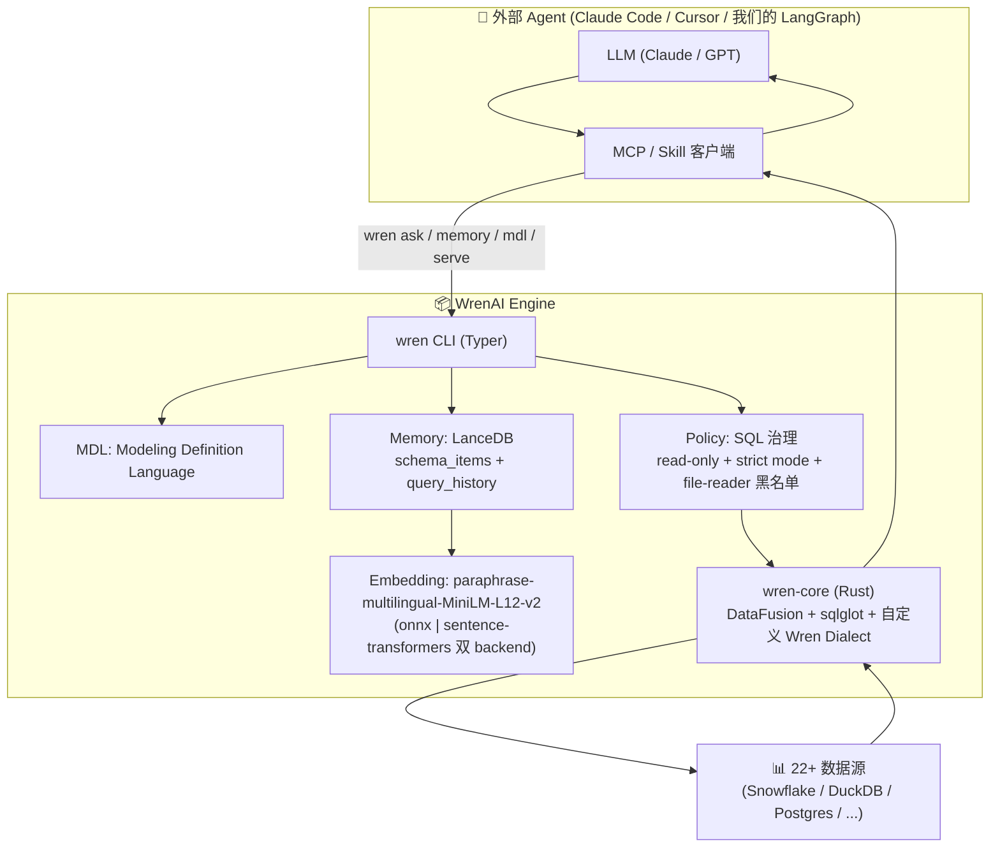
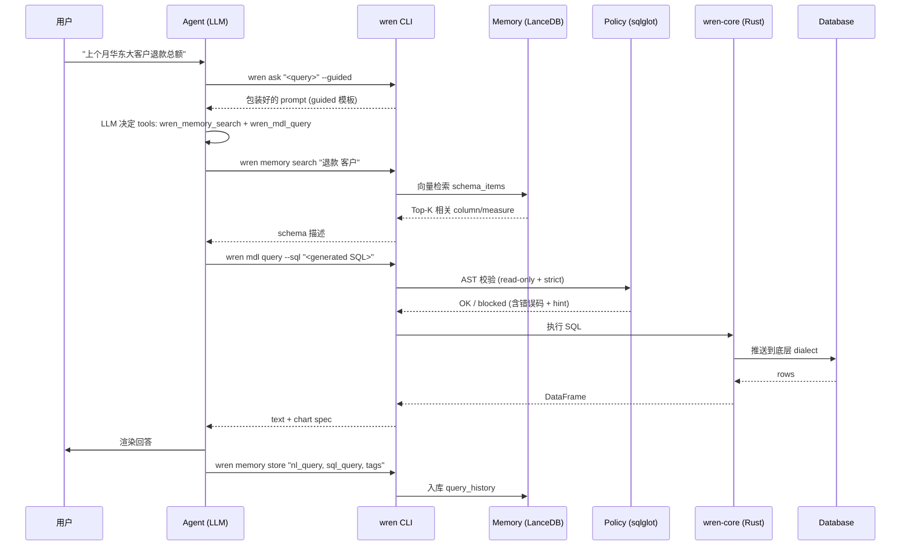

# WrenAI Deep Dive — Open-source Generative BI for AI Agents

> 研究日期:2026-09-10  
> 调研者:Lovelace / 主线程整理  
> 研究目的:为 TradingAgents "理财通用 Agent" (Stage C) 提供产品形态对标

---

## 1. 项目概览

| 项目 | Canner / WrenAI |
|------|------|
| **定位** | **Open-source Generative BI (GenBI) engine** — 给 AI agent 提供 "governed Text-to-SQL + dashboard generation + 部署" 能力 |
| **Slogan** | "Your agents generate, deploy, and govern dashboards from any database, grounded in a context layer they can actually trust." |
| **License** | Apache-2.0(主仓);核心 `wren-core` 部分 AGPL-3 |
| **规模** | 25M+(含 Rust core) |
| **技术栈** | **Rust** 核心查询引擎 (wren-core, DataFusion-based) + **Python** CLI + SDK + LanceDB 向量存储 |
| **支持数据源** | 22+ (Snowflake / BigQuery / Databricks / Postgres / DuckDB / MySQL / ClickHouse / ...) |

**核心心智**:WrenAI **不做 agent 框架本身**,而是给"已有 agent" (Claude Code / Cursor / 自定义 LangGraph) 提供 **GenBI context layer + semantic layer (MDL) + 工具集**。这是 **Agent-in-the-loop** 模式,跟 LangGraph/AutoGen 的 "framework 重" 路线相反。

---

## 2. 核心架构



**架构特点**:
- **WrenAI = Engine, 不是 Agent** — 它提供 "工具 + 上下文",agent 自己选
- **CLI 优先** — 任何 LLM agent 都能通过 `wren <cmd>` 调用,不绑定 Python 进程
- **3 大支柱**:**MDL**(语义层) + **Memory**(长期记忆) + **Policy**(治理)

---

## 3. Text-to-SQL 流程



**关键设计**:
- **`wren ask` 只是 prompt 模板**,不执行查询!真正的"问"由 agent 自己跑
- **`--guided` / `--direct` 两个模式**:前者给弱模型(加严格 task flow),后者给强模型(只 wrap 一次)
- **`wren memory store`**:每次成功 query 入库,下次相似问题可被 retrieval 复用

---

## 4. MDL:语义层(关键设计)

**MDL (Modeling Definition Language)** 是 YAML 格式的**声明式语义模型**:

```yaml
# wren-example/mdl/orders.yaml
model:
  - name: orders
    tableReference:
      schema: raw
      table: orders
    columns:
      - name: order_id
        type: varchar
        isCalculated: false
      - name: total_amount
        type: decimal(18,2)
        expression: "quantity * unit_price"
        isCalculated: true
    measures:
      - name: refund_total
        expr: "sum(case when status='refunded' then amount else 0 end)"
```

**为什么 MDL 关键**:
1. **业务语义入库**:column 的 `expression` / measure 的 `expr` 都写明,LLM 不会瞎猜
2. **Schema linking 自动化**:LLM 不用理解裸 schema,只看 MDL 里的语义定义
3. **可版本管理 / Git-friendly**:YAML 文件,diff 友好,review 友好
4. **跨数据源**:同一份 MDL 可以挂到 DuckDB / Snowflake / Postgres

**对我们的启发**:A 股数据库 (stock_daily / stock_basic / fundamentals) 也应该有 **MDL 风格的 YAML 描述**。我们的 agent 直接给 LLM 看裸 schema + 业务术语,不如给它看 "招商银行(600036.SH)属于 banking 行业,流通市值字段叫 circulating_cap" 这种结构化定义。

---

## 5. Memory 系统(对照 FinMem)

```python
# /tmp/wrenai/core/wren/src/wren/memory/store.py 核心结构
_WREN_MEMORY_DIR = Path.home() / ".wren" / "memory"

_SCHEMA_TABLE = "schema_items"     # 表结构 + 描述 的向量
_QUERY_TABLE = "query_history"     # 用户 query + 生成 SQL + tags 的向量

# Embedding
_DEFAULT_MODEL = "paraphrase-multilingual-MiniLM-L12-v2"
_DEFAULT_DIM = 384
# 双 backend: WREN_EMBEDDING_BACKEND=onnx|sentence-transformers
```

**两层记忆**:
| Layer | 存储 | 用途 |
|------|------|------|
| **schema_items** | column / measure / expression 的向量 | agent 生成 SQL 时 schema linking |
| **query_history** | 用户问句 + 生成 SQL + tags | 同类问题复用,减少 LLM 调用 |

**关键设计**:
- **LanceDB 嵌入式存储** — 不需要独立 vector DB 服务,本地化
- **multilingual MiniLM** — 多语言(支持中文)
- **memory 文件在 `~/.wren/memory/`** — 跨项目可共享
- **`wren memory watch`** — 监听 MDL 文件变更自动重建索引

---

## 6. Policy:SQL 治理(关键!)

```python
# /tmp/wrenai/core/wren/src/wren/policy.py 关键逻辑
def validate_read_only_ast(sql): ...  # 永远只允许 SELECT
def strict_mode_check(sql, mdl): ...   # strict:只允许 MDL 里声明的表
def check_data_readers(sql): ...       # read_csv/read_parquet/dblink 黑名单
```

**三层防线**:
1. **永远 read-only** — 任何 INSERT/UPDATE/DELETE/DROP 都被阻断(防御 LLM 失控)
2. **Strict mode(opt-in)** — SQL 引用的表必须在 MDL manifest 里声明,否则阻断
3. **Data-reader 黑名单** — `read_csv/read_parquet/glob/dblink/postgres_scan` 在**任何 AST 位置**都被阻断(防 SSRF / path traversal / lateral movement)

**对我们的启发**:我们 Stage C 的 agent 也要有"**写操作拦截**"层(对应 O6v2 决策)— 用户在设置页签同意后才能执行写操作。

---

## 7. UI / 前端

**当前状态**:
- **新版本(主仓)无内置 UI** — Agent-in-the-loop,前端在客户端(Claude Code / Cursor)
- **legacy/v1 分支**:Wren GenBI Classic,Chat-first BI 前端(Docker 部署)
- **`wren serve`**:启动本地 Web UI,展示 MDL + sample queries

**前端形态参考**:
- legacy/v1 的 chat UI 是 "输入框 + 流式回答 + chart 嵌入" 的经典 GenBI 形态
- 跟我们 Stage C 要做的 "抽屉式 chat agent" 非常相似

---

## 8. 跟我们项目的对标启示

| WrenAI 设计 | 我们 TradingAgents 现状 | 启示 |
|------|------|------|
| **MDL 语义层** | agent 直接看裸 SQLite schema | **Stage C 应建 `agent/mdl/*.yaml`**:声明常用 table / column / business terms |
| **Memory 双层 (schema + query_history)** | 我们规划 L1/L2/L3 三层 | 借鉴 schema_items 做法,把数据库结构向量化入 L1 |
| **Policy 三层防线** | 无写操作拦截 | **必做** — 写操作前 confirm + audit log(对应 O6v2) |
| **CLI-first + 多 agent 兼容** | agent 绑 LangGraph | **可借鉴**:把核心 tools 也暴露为 CLI / MCP,让外部 agent 也能用 |
| **Rust core + Python SDK** | 纯 Python | 性能层(wren-core)是 Rust,SDK 是 Python — 我们现在用不上 Rust,但 web 后端可考虑用 Rust 加速 |
| **LanceDB 本地存储** | 用 SQLite | **可加 LanceDB 存 schema_items**,不替代业务 SQLite |
| **wren ask 两种模式** | 单模式 | agent 可分 "复杂查询" vs "简单问答" 两套 prompt |

---

## 9. 借鉴清单(直接落地)

1. **建 `agent/mdl/stock_market.yaml`** — 声明 stock_daily / stock_basic / fundamentals / watchlist 等表的语义 + 计算字段 + 业务规则
2. **LanceDB 替代 FinMem 的 memory store** — LanceDB 比 chroma/qdrant 轻量,适合本地
3. **SQL 三层治理** — read-only 默认 + write confirm + 数据源白名单
4. **`agent ask` CLI** — 给外部 agent(Claude Desktop)调用我们的工具,不用启动整个 web
5. **`--guided / --direct` 双 prompt 模板** — 强模型(如 Claude Opus)用 direct,弱模型用 guided
6. **MDL 走 git 管理** — 业务定义可 review,跟代码一样可追溯
7. **`memory watch` 监听 MDL 变更** — MDL 改完自动 rebuild schema index
8. **`wren memory store` 自动入库 query_history** — 每次成功 query 入库,下次复用
9. **Embedding 用 `paraphrase-multilingual-MiniLM-L12-v2`** — 384 维,多语言,够用且轻量
10. **`~/.wren/memory/` 跨项目共享** — 我们的 agent memory 也应放 `~/.tradingagents/agent_memory/`

---

## 10. 风险 / 坑

1. **Rust core 编译复杂** — wren-core 是 Rust + DataFusion,Python 端通过 pyO3 调用。引入需要额外 CI 编译步骤
2. **MDL YAML 维护成本** — 业务定义要人维护,我们数据库结构还不稳定,MDL 可能频繁变
3. **LanceDB 嵌入式** — 单机 OK,但多用户 / 分布式场景不行,我们现在是单机 OK
4. **`wren ask` 只是 prompt 包装** — 真正的 LLM 调用在外部 agent,我们自己做 Stage C 时要自己实现 LLM 调用循环
5. **AGPL-3 部分** — `wren-core` 是 AGPL,商用要小心。我们只参考设计,不直接用其 binary
6. **legacy/v1 vs 新版分裂** — 用户体验看 legacy/v1 更好,但社区正在迁新,要看长期
7. **前端在外部 agent** — 用户要装 Claude Desktop / Cursor 才有 UI,跟我们的 "Web 内嵌" 不一样

---

## 11. 关键文件路径(相对项目根)

```
/tmp/wrenai/
├── README.md                                  # 项目介绍
├── core/
│   ├── wren/src/wren/
│   │   ├── ask.py                             # 33 行,prompt 模板
│   │   ├── ask_cli.py                         # CLI 入口
│   │   ├── policy.py                          # 560 行,SQL 治理 ⭐
│   │   ├── mdl/wren_dialect.py                # sqlglot 自定义方言
│   │   ├── memory/
│   │   │   ├── store.py                       # 745 行,LanceDB ⭐
│   │   │   ├── index_backend.py               # 186 行
│   │   │   ├── schema_indexer.py              # schema 索引
│   │   │   ├── embeddings.py                  # 双 backend embedding
│   │   │   └── watch.py                       # MDL 变更监听
│   │   └── serve_cli.py                       # 本地 web 服务
│   ├── wren-core/                             # Rust 查询引擎 (DataFusion)
│   ├── wren-mdl/                              # MDL 解析器
│   └── wren-core-py/                          # Python 绑定
├── sdk/
│   ├── wren-langchain/                        # LangChain tool 集成 ⭐
│   └── wren-pydantic/                         # Pydantic models
└── skills/                                    # Agent skills (Claude/Cursor)
    └── wren/SKILL.md                          # discovery stub
```

---

**TL;DR**:WrenAI 给我们最重要的启示是**"语义层 (MDL) + 记忆 (Memory) + 治理 (Policy) 三件套"**。我们 Stage C 的设计可以吸收这三层,但不必搬它的 Rust core,Python 端用 LanceDB + SQLite 即可落地。
