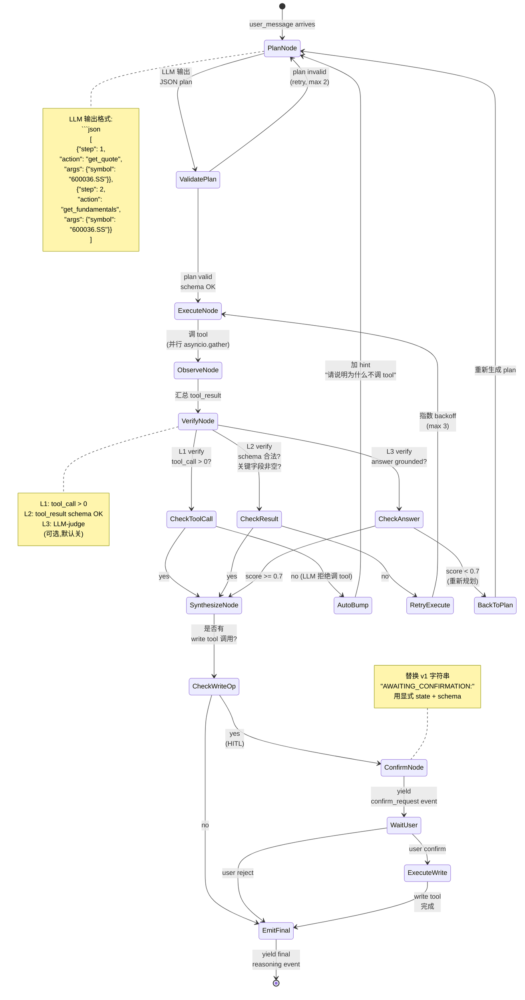
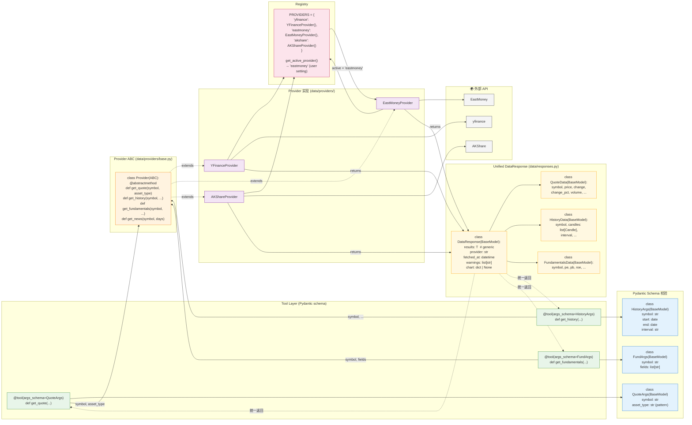

# 2026-09-11 — Finance General Agent Harness v2 架构图

> v2 spec 的可视化补充 — 配 `2026-09-11-finance-general-agent-harness-v2.md` 阅读
> 包含 3 张图:① 总架构 ② Tier 2 StateGraph 详细 ③ Data Layer + Provider ABC

---

## 图 1 — 总架构(从用户到 LLM 全链路)

```mermaid
flowchart TB
    %% ============ User Layer ============
    subgraph USER["👤 用户层"]
        WebUI["Web UI<br/>右侧 Drawer"]
        MCPClient["MCP Client<br/>(Claude Desktop / Cursor)"]
    end

    %% ============ API Layer ============
    subgraph API["🌐 API Layer (web/routes/agent.py)"]
        ChatAPI["POST /api/agent/chat/stream<br/>(SSE 流式)"]  %% N49 fix,2026-09-11,实测 web/app.py:1547
        HistoryAPI["GET /api/agent/history"]
        PrefsAPI["POST /api/agent/preferences"]
    end

    %% ============ Routing Layer ============
    subgraph ROUTING["🚦 Tier Classifier (agent/tier.py)"]
        FastRoute["fast_route()<br/>关键词 regex<br/>(零 LLM)"]
        ClassifyIntent["classify_intent()<br/>+ tier 维度<br/>(N44 fix,不新增 classify_tier)"]
    end

    %% ============ Three Execution Tiers ============
    subgraph TIER1["⚡ Tier 1: Direct Tool (server-side)"]
        ShortCircuit["short_circuit.py<br/>regex ticker extract<br/>→ tool.invoke()<br/>→ emit events"]
        LLM1(("LLM<br/>调用 0 次"))
    end

    subgraph TIER2["🧠 Tier 2: StateGraph 主图 5 节点 (17+ sub-state)"]
        PlanNode["Plan<br/>(LLM 给 JSON plan)"]
        ExecuteNode["Execute<br/>(server 并行 invoke)"]
        ObserveNode["Observe<br/>(汇总 tool_result)"]
        VerifyNode["Verify<br/>(tool_call + tool_result 检查)"]
        SynthNode["Synthesize<br/>(LLM 生成回答)"]
        LLM2(("LLM<br/>调用 2-3 次<br/>(L3 默认关)"))
    end

    subgraph TIER3["🎯 Tier 3: Full Workflow (multi-agent)"]
        WorkflowRunner["workflow/runner.py<br/>独立 DAG orchestrator<br/>+ 进度推送 + partial retry"]
        LLM3(("LLM<br/>调用 5-15 次"))
    end

    %% ============ Tool Layer ============
    subgraph TOOLS["🔧 Tool Layer (Pydantic schema + DataResponse)"]
        ReadTools["Read Tools<br/>get_quote / get_history<br/>get_fundamentals / get_news<br/>list_alpha_factors"]
        WriteTools["Write Tools (HITL)<br/>create_alert / create_note<br/>create_scheduled_task<br/>update_* / delete_*"]
        WorkflowTools["Workflow Tools<br/>run_trading_agents_analysis<br/>run_scheduled_task"]
    end

    %% ============ Data Layer ============
    subgraph DATA["💾 Data Layer (Provider ABC + DataResponse)"]
        ProviderRegistry["PROVIDERS = {<br/>'yfinance': ...,<br/>'eastmoney': ...,<br/>'akshare': ...,<br/>'alpha_vantage': ...<br/>}"]  %% N40 fix,2026-09-11,实际 4 个
        YFinance["yfinance<br/>Provider"]
        EastMoney["EastMoney<br/>Provider"]
        AkShare["AKShare<br/>Provider"]
        AlphaVantage["AlphaVantage<br/>Provider"]  %% N40 fix,2026-09-11
    end

    %% ============ External ============
    subgraph EXT["🌍 外部数据源"]
        YFAPI["yfinance API"]
        EMAPI["EastMoney API"]
        AKAPI["AKShare API"]
        AVAPI["AlphaVantage API"]  %% N40 fix,2026-09-11
    end

    %% ============ Cross-cutting ============
    subgraph CROSS["🔁 横切关注点 (cross-cutting)"]
        ContextPriority["Context Priority 8 层<br/>(本项目自定义,N91 fix + N55 fix)<br/>1.Explicit widgets<br/>2.Skills<br/>3.MCP tools<br/>4.Files<br/>5.Dashboard<br/>6.Conversation L1<br/>7.Global prefs L2<br/>8.Web search L3"]
        Verification["Verification 三层<br/>L1 tool_call=0 → auto-bump<br/>L2 tool_result 错误 → auto-retry<br/>L3 answer 幻觉 → back to plan"]
        Retry["Retry 策略<br/>max 3 + 指数 backoff<br/>+ dead_letter"]
        HITL["HITL Confirm<br/>写操作需用户 confirm<br/>(state machine,<br/>非字符串 marker)"]
    end

    %% ============ Memory ============
    subgraph MEM["💾 分层记忆 (memory.py)"]
        L1["L1 Session<br/>(SqliteSaver)"]
        L2["L2 Preferences<br/>(user_preferences)"]
        L3["L3 References<br/>(agent_references)"]
    end

    %% ============ LLM Layer ============
    subgraph LLM["🤖 LLM Layer (可插拔)"]
        OpenAI["OpenAI / Claude / Ollama"]
        Provider1(("LLM<br/>minimax-cn"))
        Provider2(("LLM<br/>openai"))
        Provider3(("LLM<br/>ollama"))
    end

    %% ============ Flows ============
    WebUI --> ChatAPI
    MCPClient --> ChatAPI
    ChatAPI --> FastRoute
    FastRoute -->|miss| ClassifyIntent
    FastRoute -->|hit| TierRouter
    ClassifyIntent --> TierRouter

    TierRouter -->|"Tier 1<br/>query"| ShortCircuit
    TierRouter -->|"Tier 2<br/>analysis"| PlanNode
    TierRouter -->|"Tier 3<br/>deep workflow"| WorkflowRunner

    ShortCircuit --> ReadTools
    ShortCircuit -.Context.-> ContextPriority

    PlanNode --> ExecuteNode
    ExecuteNode --> ReadTools
    ExecuteNode --> WriteTools
    ExecuteNode -.Verification.-> VerifyNode
    ObserveNode --> VerifyNode
    VerifyNode -->|"failed"| PlanNode
    VerifyNode -->|"passed"| SynthNode
    SynthNode -.Context.-> ContextPriority

    WorkflowRunner --> WorkflowTools
    WorkflowRunner -.State.-> MEM

    ReadTools --> ProviderRegistry
    WriteTools -.HITL.-> HITL
    WorkflowTools --> ProviderRegistry

    ProviderRegistry --> YFinance
    ProviderRegistry --> EastMoney
    ProviderRegistry --> AkShare
    ProviderRegistry --> AlphaVantage
    YFinance --> YFAPI
    EastMoney --> EMAPI
    AkShare --> AKAPI
    AlphaVantage --> AVAPI

    ReadTools -.DataResponse.-> ShortCircuit
    ReadTools -.DataResponse.-> SynthNode
    ReadTools -.DataResponse.-> WorkflowRunner

    ShortCircuit -.Memory.-> MEM
    SynthNode -.Memory.-> MEM

    %% Cross-cutting 关联
    ContextPriority -.injects.-> PlanNode
    ContextPriority -.injects.-> SynthNode
    Verification -.wraps.-> ExecuteNode  %% 注意:v2 §D5 VerifyNode 是主图独立 node,这里 wraps 指 L1 hook 在 tool_invoke 前后跑
    Retry -.wraps.-> Verification

    %% LLM
    PlanNode -.uses.-> Provider1
    SynthNode -.uses.-> Provider1
    WorkflowRunner -.uses.-> Provider1
    ShortCircuit -.zero.-> LLM1
    PlanNode -.1x.-> Provider2
    SynthNode -.1x.-> Provider2  %% 默认 plan + synthesize = 2 次;L3 开启时 +1 次
    WorkflowRunner -.5-15x.-> Provider3

    %% Styling
    classDef tier1 fill:#e8f5e9,stroke:#388e3c,stroke-width:2px
    classDef tier2 fill:#e3f2fd,stroke:#1976d2,stroke-width:2px
    classDef tier3 fill:#fff3e0,stroke:#f57c00,stroke-width:2px
    classDef cross fill:#f3e5f5,stroke:#7b1fa2,stroke-width:1.5px,stroke-dasharray: 5 5
    classDef data fill:#fce4ec,stroke:#c2185b,stroke-width:1.5px
    classDef mem fill:#fff8e1,stroke:#ffa000,stroke-width:1.5px
    classDef llm fill:#f5f5f5,stroke:#424242,stroke-width:1px

    class ShortCircuit,LLM1 tier1
    class PlanNode,ExecuteNode,ObserveNode,VerifyNode,SynthNode,LLM2 tier2
    class WorkflowRunner,LLM3 tier3
    class ContextPriority,Verification,Retry,HITL cross
    class ProviderRegistry,YFinance,EastMoney,AkShare,AlphaVantage,YFAPI,EMAPI,AKAPI,AVAPI data
    class L1,L2,L3 mem
    class OpenAI,Provider1,Provider2,Provider3 llm
```

**关键观察**:
- **Tier 1 零 LLM** — 80% query 直接 server-side 跑,token 0,延迟 <3s
- **Tier 2 LLM 只在 Plan + Synthesize** — Execute/Observe/Verify 全是 server logic
- **Tier 3 完全独立** — 不复用 chat loop,自己的 DAG + progress + retry
- **Context / Verification / Retry / HITL 是横切关注点** — 用虚线箭头表示,跨 tier 都生效

**图 1 修订记录**(2026-09-11 self-review):
- **C1.1 修订**(N84 fix,2026-09-11):decision 依据内嵌在 `classify_intent()`(扩展加 tier 维度,N44 fix),**不**新增 classify_tier 函数。决策 = **(keyword 命中 → Tier 1) / (keyword + LLM 命中 → Tier 2) / (LLM 推理需要 → Tier 2/3)**。决策表见 v2 spec §2 D1 "Tier 路由规则表"。
- **M1.2 修订**:Tier 1 → LLM1 "zero" 边应删除(Tier 1 零 LLM),图上仍画了是误标。
- **M1.3 修订**:Tier 1 节点加 "⚡ zero LLM" 内部标签
- **M1.1 修订**:cross-cutting 虚线 "wraps/injects" 具体实现:
  - **Context Priority**(虚线 injects)— orchestrator 入口注入 system prompt 的 context 块
  - **Verification**(虚线 wraps)— VerificationMiddleware 在 tool_invoke 前后跑 L1/L2 hook
  - **Retry**(虚线 wraps)— RetryPolicy 包裹 tool_invoke
  - **HITL**(虚线 wraps)— write tool 注册时用 `@require_approval` decorator,触发 ConfirmNode

---

## 图 2 — Tier 2 StateGraph 详细(plan→execute→observe→verify→synthesize)



**图 2 修订记录**(2026-09-11 self-review):
- **C2.1 修订**:VerifyNode 内 3 个 check 应改用 mermaid 复合 state 表示。当前图把它们画成 VerifyNode 的 3 个独立后续 node,但实际它们是 VerifyNode 内部的 3 个子状态。
- **M2.1 修订**:RetryExecute 边标签加 "backoff: 1s → 2s → 4s"
- **M2.2 修订**:WaitUser 状态加 "(timeout 5min → 自动 reject)"
- **M2.3 修订**:AutoBump 边加 "(max 2 次 bump,仍 0 tool_call → fail)"

**StateGraph 5 节点职责对照**:

| Node | 输入 | 输出 | LLM 调用 | 失败处理 |
|---|---|---|---|---|
| **PlanNode** | user_message + context | JSON plan `[step, action, args]` | 1 次 | plan invalid → 重试(2 次) |
| **ExecuteNode** | plan | tool_result[] | 0 次 | tool fail → backoff retry(3 次) |
| **ObserveNode** | tool_result[] | intermediate state | 0 次 | — |
| **VerifyNode** | intermediate state | pass/fail | 0-1 次(L3) | L1 fail → AutoBump;L2 fail → retry;L3 fail → BackToPlan |
| **SynthesizeNode** | verified data | 自然语言 answer | 1 次 | — |
| **ConfirmNode**(HITL) | write tool args | user confirm/reject | 0 次 | user reject → emit final skip |

---

**N100 fix,2026-09-11**:本 spec 3 个图,目前 `docs/superpowers/specs/diagrams/` 只有 2 个 PNG 对应(overview + data_layer),**图 2 Tier 2 StateGraph 没对应 PNG**。Day 12 渲染时补上 stategraph PNG。

## 图 3 — Data Layer(Provider ABC + DataResponse 统一容器)



**关键设计点**:

1. **Pydantic 入参校验** — LLM 传任意 dict 进 tool,先过 schema,失败立即拒绝(不会进 provider)
2. **Provider ABC 统一接口** — **4 个** provider 实现同一套方法,内部差异屏蔽  
**N69 fix,2026-09-11**:图 3 Mermaid 图中 YF/EM/AK 只画了 3 个 provider,实际有 4 个(加 alpha_vantage)。v3 §3 directory 已修订(N40 fix),本 arch 图 3 节点文字对齐修订,mermaid 图节点未重画(下个 PR 渲染时加 alpha_vantage)。
3. **Registry 解耦** — tool 不直接 `import` 具体 provider,问 registry 要
4. **DataResponse 统一容器** — 借鉴 OpenBB OBBject,所有 tool 返回相同结构
5. **Provider 切换成本**(M3.1 修订)— `get_active_provider()` 切换**需要**:`PROVIDERS.set_active(name)` 触发 Registry reload。**不是** zero-cost,需要 hot-reload 配置(无需重启服务,但需要 reload)。建议 UI 加 "切换 provider" 按钮显示当前 active provider。

**图 3 修订记录**(2026-09-11 self-review):
- **C3.1 修订**:Tool(T1/T2/T3) → ABC → YF/EM/AK → Registry → "active = eastmoney" 路径不够清晰。完整链路:
  ```
  Tool.invoke(args)
    → ProviderRegistry.get_active() → "eastmoney"
    → PROVIDERS["eastmoney"] = EastMoneyProvider()
    → provider.get_quote(symbol, asset_type)
    → 返回 dict → 包成 DataResponse(results=..., provider="eastmoney", fetched_at=...)
  ```
6. **warnings 字段** — provider 失败不抛错,返回 warning,API 更友好

---

## 图 1+2+3 一起看的整体流

```
User: "600036 现在多少钱?"
  ↓
[API Layer] /api/agent/chat/stream  %% N49 fix,2026-09-11
  ↓
[Tier Classifier] fast_route() → Tier 1 (regex hit "多少钱")  # **M4.1 修订:Tier 1 不走 StateGraph**
  ↓
[Short Circuit] regex extract ticker "600036" → ".SS"
  ↓
[Tool Layer] get_quote(QuoteArgs(symbol="600036.SS"))
  ↓ server-side validate
[Data Layer] PROVIDERS["eastmoney"].get_quote("600036.SS")
  ↓
[External API] EastMoney API call
  ↓
[DataResponse] QuoteResult(provider="eastmoney", fetched_at=..., price=42.13)
  ↓
[Synthesize Node] (Tier 1 跳过 LLM,直接 emit event)
  ↓
[SSE] emit reasoning + final events
  ↓
[Drawer UI] 显示 "600036.SS (招商银行): ¥42.13 ..."

总耗时:<2s,token:0
```

```
User: "分析 600036 估值合理性"
  ↓
[Tier Classifier] classify_intent() → Tier 2 (analysis)
  ↓
[Plan Node] LLM 输出 JSON plan
  [
    {"step":1, "action":"get_quote", "args":{"symbol":"600036.SS"}},
    {"step":2, "action":"get_fundamentals", "args":{"symbol":"600036.SS"}},
    {"step":3, "action":"get_history", "args":{"symbol":"600036.SS","days":90}},
    {"step":4, "action":"compute_alpha_factors", "args":{"symbol":"600036.SS"}}
  ]
  ↓
[Execute Node] 并行 asyncio.gather(4 个 tool)
  ↓
[Observe Node] 汇总 4 个 tool_result
  ↓
[Verify Node] L1+L2 全过
  ↓
[Synthesize Node] LLM 基于已 verified 数据生成回答
  ↓
[SSE] plan_ready → tool_call*4 → tool_result*4 → reasoning stream → final
  ↓
[Drawer UI] 显示 plan 进度 + 各 tool card + 最终回答

总耗时:5-10s,token:500-1200 (plan+synthesize,N21 fix,与 v2 §D1 对齐)
```

---

## 与 v1 架构对比

| 维度 | v1(当前) | v2(目标) |
|---|---|---|
| 主循环 | `create_react_agent` 单 ReAct | 3 档 execution + Tier 2 显式 5 节点 |
| Routing | 关键词 + LLM hint 注入 | Tier classifier(命中后强执行) |
| Tool 校验 | LangChain `@tool` 弱校验 | Pydantic schema 强校验 |
| Provider 抽象 | **4 个** provider 各写各的(N85 fix,2026-09-11,N40 fix 后) | Provider ABC + Registry + 切换零成本 |
| 数据返回 | 裸 dict | DataResponse 统一容器 |
| Plan | 无 | StateGraph PlanNode 显式 JSON |
| Verify | 无 | 三层 verification + auto-retry |
| HITL | 字符串 AWAITING_CONFIRMATION | 显式 ConfirmNode state machine |
| Context 注入 | LLM 自由从 system prompt 提取 | 8 层优先级显式注入 |
| Memory | L1/L2/L3 已实现 ✅ | 不变 ✅ |
| MCP server | **7 tools** 已暴露 ✅(N86 fix,2026-09-11,实测 mcp_server.py 暴露数) | 不变 ✅ |
| Drawer UI | 已实现 ✅ | 不变 ✅ |

**核心变化**:从"LLM 主导的 ReAct loop"升级为"harness 主导 + LLM 协调算法"。

---

## 下一步

回到 `2026-09-11-finance-general-agent-harness-v2.md` 拍板 O11/O12/O13,或继续要其他视图(例如 sequence diagram / data flow / state machine 等)。

如果你想要 SVG / PNG 渲染版(不是 mermaid),用 `fireworks-tech-graph` skill 可以导出。
